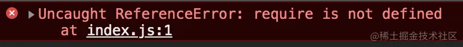
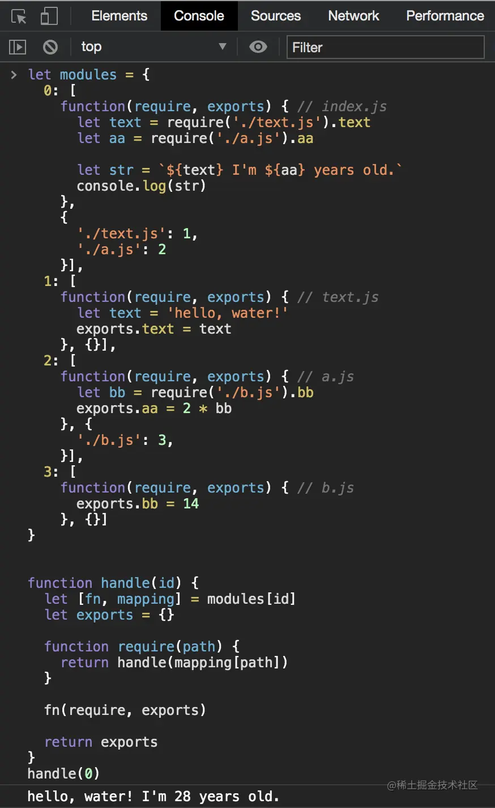
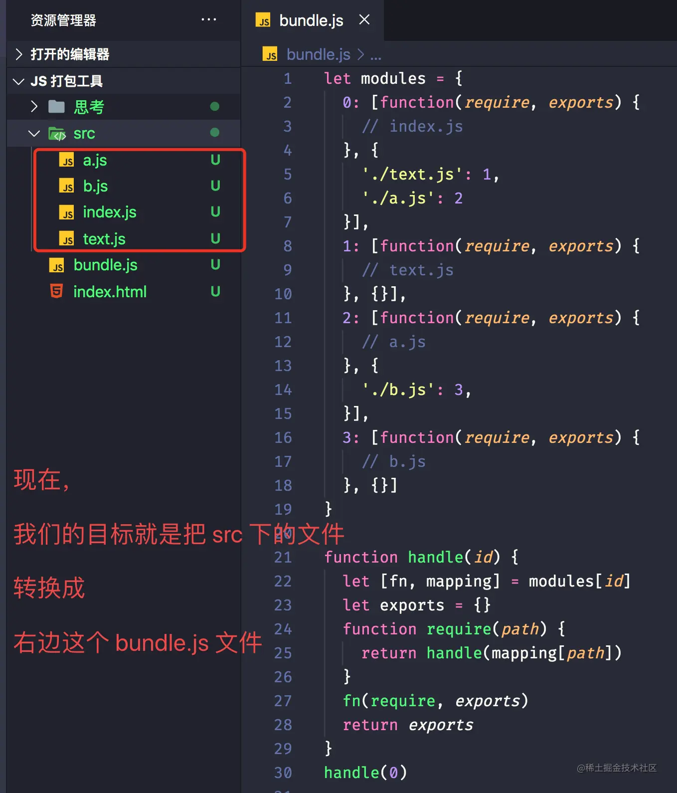
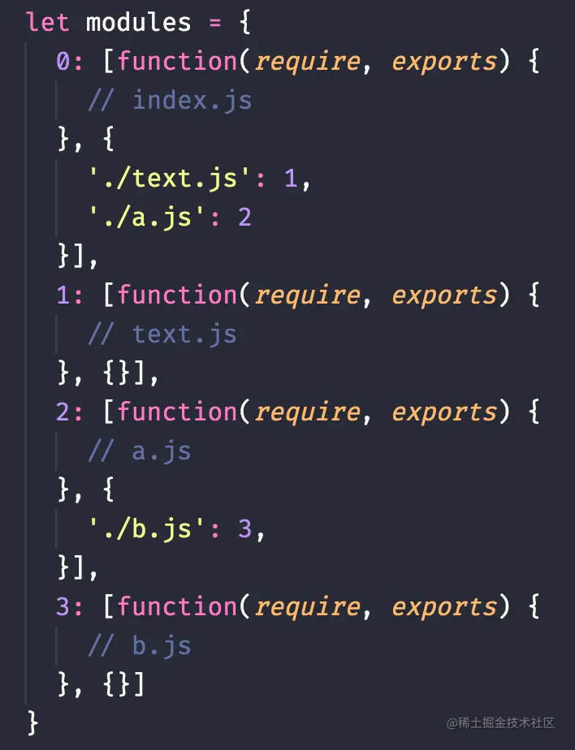
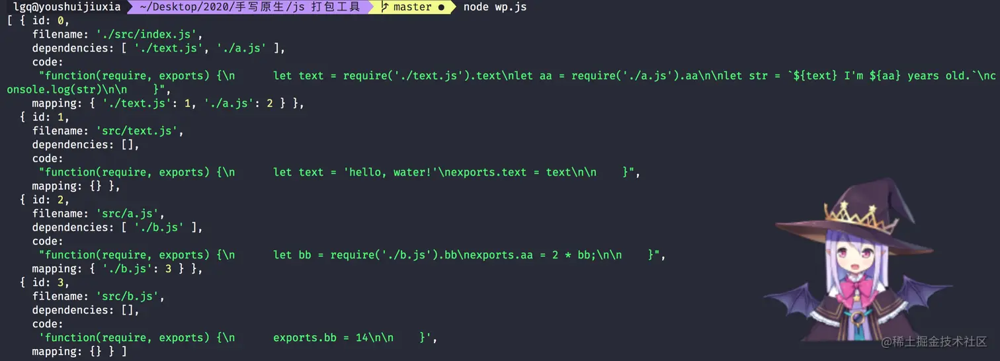
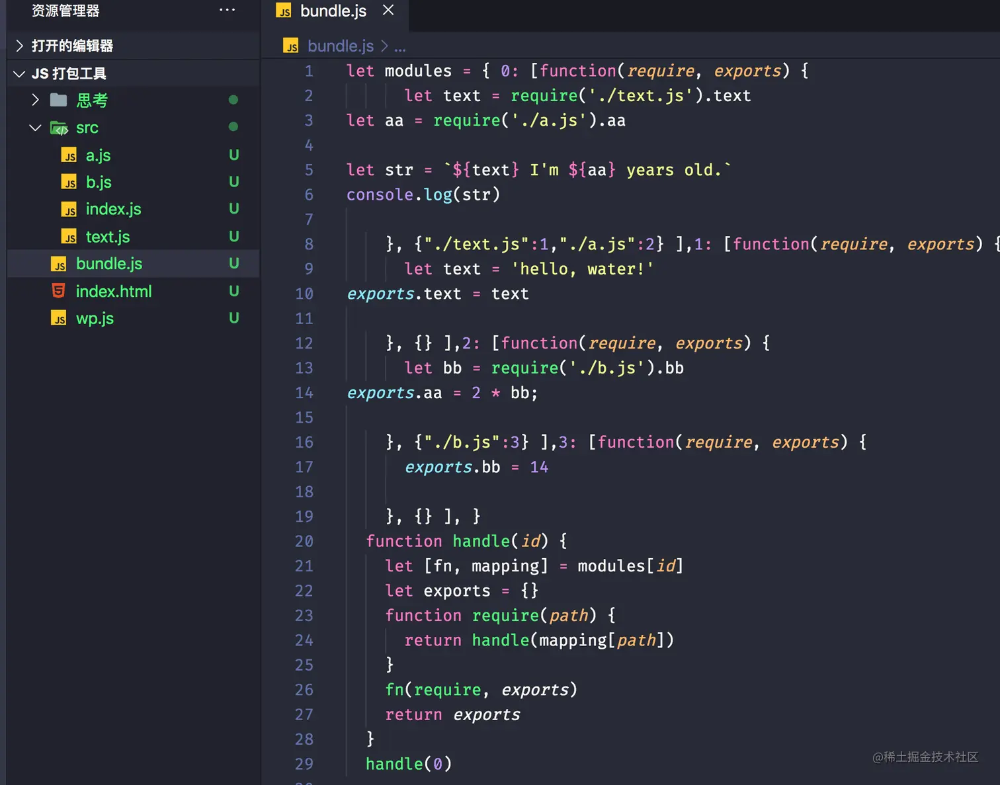

## 抛出问题
现在我们有如下四个文件👇：
```js

js 代码解读复制代码// index.js
let text = require('./text.js').text
let aa = require('./a.js').aa

let str = `${text} I'm ${aa} years old.`
console.log(str)

// text.js
let text = 'hello, water!'
exports.text = text

// a.js
let bb = require('./b.js').bb
exports.aa = 2 * bb

// b.js
exports.bb = 14
```

当我们用 node 去运行 index.js 的时候，会得到这样的结果 hello, water! I'm 28 years old.。但是当我们直接在 html 中引入该 index.js 文件，控制台是会报错的，就像下面这样（相信大家都应该见过）：


那很显然了，浏览器已经很直白的告诉我们说没有定义 `require` 这个函数，所以无法执行。而在 `node` 中呢，其实是有 `require` 这个内置函数的，也就是 `node` 的模块化机制。那么问题来了，如何才能让刚才那些代码在浏览器中运行呢？当一个项目越来越大的时候，文件拆分是必不可少的，我们又要如何整合这些代码呢？
👉 答案就是打包工具啦，当然了，现成的打包工具有很多，最为我们前端所熟知的就是 `webpack` 了，但是这个东西贼繁琐，理解和熟悉起来还是有一定门槛的，而且容易忘。恰巧最近在学习的时候看到了一个非常棒的打包思路（是真的棒👍），所以特此沉淀分享✍，希望能对大家有所帮助。

那么，我们先在这里明确一下本文的目标：就是手写一个轻量级的 js 打包工具，将上面的多个 js 文件最终打包成一个 bundle.js 文件，使得这个 bundle.js 文件能在浏览器中运行，并且不依赖其他包，也不涉及什么晦涩难懂的 AST，当然也不是写一个简版的 webpack，这里只是打包 js 文件，所以理解起来并不困难，请放心食用🍖。
## 思考
### 思考1
我们要把多个文件打包成一个文件，那最粗略的做法是什么呢？就是直接拷贝过来啦，都拷到同一个文件下就好啦，显然这样是行不通的，毕竟 `require` 和 `exports` 是啥东西都不知道。。。那所以，我们可以这样搞，我们把每个零散的 js 文件当作是一个个函数（就是一个个模块，函数本身就有这样的性质，把自己和外界隔离开来），这样一来就 `require` 和 `exports` 就可以通过传参的方式传递进来（自身没有就从外面拿），看下下面的实例代码你就明白了👇：
```js
// bundle.js
function (require, exports) { // index.js
  let text = require('./text.js').text
  let aa = require('./a.js').aa

  let str = `${text} I'm ${aa} years old.`
  console.log(str)
}

function (require, exports) { // text.js
  let text = 'hello, water!'
  exports.text = text
}

function (require, exports) { // a.js
  let bb = require('./b.js').bb
  exports.aa = 2 * bb
}

function (require, exports) { // b.js
  exports.bb = 14
}

```
好吧，其实这步也没做啥，仅仅只是把每个文件都拷贝了过来包装了一下，虽然我们还不知道 require 和 exports 是啥，但至少现在每个 js 文件都变成了函数，让我们看到了执行的可能性😬。
### 思考2
不知道你发现了没有，上面思考的代码有个问题🤔，函数没有名字，由于我们最终会打包生成一个 js 文件，如果源文件多了，也就是函数多了，那我们该怎么区分这些函数呢，我们不可能一个个取名字吧🚫，如果模块很多，取名字和冲突都是问题，所以我们需要有效的区分这些模块，简单点就是给个 id 啦，具体怎么给怎么对应，看下面这段代码就明白了👇：
```js
// bundle.js
let modules = {
  0: function(require, exports) { // index.js
    let text = require('./text.js').text
    let aa = require('./a.js').aa

    let str = `${text} I'm ${aa} years old.`
    console.log(str)
  },
  1: function(require, exports) { // text.js
    let text = 'hello, water!'
    exports.text = text
  },
  2: function(require, exports) { // a.js
    let bb = require('./b.js').bb
    exports.aa = 2 * bb
  },
  3: function(require, exports) { // b.js
    exports.bb = 14
  }
}
```
是不是突然间变得清爽了很多😁。。。


### 思考3
现在我们已经有了每个函数的映射关系，可以看到 `modules[0]` 就是我们的入口函数，而我们最终的期望就是去执行这个入口函数，所以先写个简单的执行函数（记得看注释）👇：
```js
// bundle.js
function handle(id) {
  // 根据 id 取出对应的函数（文件或模块都行，一个意思，后续不做区分）
  let fn = modules[id]
  
  // 因为需要传入两个参数 require 和 exports，所以要先声明一下
  let exports = {} // 就是个空对象，用来存放每个模块导出的值
  function require(path) { // path 就是文件路径，平时我们的用法就是这样
    // 先不管里面是啥，但你要知道他的作用
    // 就是根据路径去找到相应的文件 + 执行该文件（也就是函数） + 返回函数结果
  }
  
  // 执行该函数即可
  fn(require, exports)
  
  // 导出 exports 对象，该对象里面就是要导出的值
  return exports
}
handle(0) // 传入的是文件 id，这里从入口文件开始执行
```

上面的代码可能会让你困惑的地方应该就是 `require` 和 `exports` 的声明了。我也看了些文章，讲的不是很通俗易懂，确实是它本身不怎么好描述，所以这里呢，我将以我的方式给大家讲解一下，当然我也不知道我讲的好不好懂😂：

- 首先我们知道一个函数就是一个模块（一个文件）
- 既然是模块，并且模块之间能相互引用（就是有依赖关系），那模块自然就要有两个东西：一个是模块所需要的依赖，一个是模块的返回值
- require 承载的就是模块所需要的依赖，exports 承载的就是模块的返回值（好好体会一下）🤔
- require 本质就是一个函数，作用就是根据路径找到相应的依赖（函数）并执行
- exports 本来是个空对象，但模块导出的东西会挂载到 exports 这个对象上，就像我们平时导出写的那样 - exports.xxx = 10，然后才能取到 xxx 的值就拿我们上面的 a.js 文件来说，大概的过程就像下面这样子：

```js
// a.js
let bb = require('./b.js').bb // 通过 require 这个函数去找到 b 文件，然后执行 b 文件，这时候 b 文件会返回 exports = { bb: 14 } 这么个东西
exports.aa = 2 * bb; // 这里是 a 文件的导出，也就是向 exports 这个空对象上挂载了 aa 这个属性
```

### 思考4
现在我们已经可以通过 `id` 来找到对应的模块了，可是我们 `require` 的入参是 `path`，平时写 `require` 的时候是需要根据路径来找到相应模块的，现在要通过 `path` 来找到相应的模块对我们来说好像有点变扭😕，所以我们需要对 `modules` 里面的结构做一些小调整，先直接看下修改后的结果👇：
```js
// bundle.js
let modules = { // 这里主要就是把 modules 每一项变成一个数组，数组的第一项还是原来的函数，第二项是依赖路径和 id 的映射，这样我们就能通过路径转 id 找到对应的模块了
  0: [function(require, exports) { // index.js
      let text = require('./text.js').text
      let aa = require('./a.js').aa

      let str = `${text} I'm ${aa} years old.`
      console.log(str)
    }, {
      './text.js': 1,
      './a.js': 2
    }],
  1: [function(require, exports) { // text.js
      let text = 'hello, water!'
      exports.text = text
    }, {}],
  2: [function(require, exports) { // a.js
      let bb = require('./b.js').bb
      exports.aa = 2 * bb
    }, {
      './b.js': 3,
    }],
  3: [function(require, exports) { // b.js
      exports.bb = 14
    }, {}]
}
```

上面的代码应该还算直观，这样一来我们的 handle 函数也需要做相应的处理，变成下面这样：
```js
// bundle.js
function handle(id) {
  let [fn, mapping] = modules[id] // 这个是解构赋值，就是取数组的第一项和第二项
  let exports = {}

  function require(path) { // require 的作用就是找到对应的模块，然后执行，拿到返回值
    // mapping[path] 就是对应模块的 id
    return handle(mapping[path]) // 就是 return exports 对象，这样我们就能够拿到导出的值
  }

  fn(require, exports) // 取到对应的依赖并执行

  return exports
}
handle(0)
```

其实上面的代码和原来的相比就多了个从路径转 id 再找到模块的过程，从 `mapping` 这个变量就可以体现出来。
然后现在就是见证奇迹的时刻了😏，我们把这段代码拿到浏览器去执行，惊喜的发现能成功打印👏：


喔~ It's amazing!💯但是我们的事情还没有结束，目前我们的 `modules` 里面的模块都是写死的，所以接下来才是我们真正要做的事情，就是如何把源文件自动转换成上述代码，只要能转换成上述代码，就能使之够在浏览器中运行。所以现在我们的目标就是转换，下面这张图理解起来应该会容易点：


## 开始手写
那所以，这个 `bundle.js` 文件到底该怎么生成呢？这里大家可以稍微想个几秒钟再往下看🤔。。。当然这里还要依靠一丢丢 `node` 的知识，如果不了解 `node` 的话可以看下我之前写的一篇文章（传送门：有助于理解前端工具的 `node` 知识），写的还不错哦，欢迎点赞。不过不看其实也没有关系，不影响理解😬。
👌，其实我们要生成这个 `bundle.js` 的思路应该是大同小异。简单来说就是要先读取入口文件并进行依赖分析，然后想方设法拼凑一堆字符串，使之成为 `bundle.js` 中的模样，最后写入到 `bundle.js` 中即可。现在就让我们开始动手吧（我们写的文件叫 wp.js）。

### 读取文件
这一步很简单啦，我们直接用 node 中的 fs 模块（用来读写文件的，一般构建工具少不了它）读取入口文件即可，该 api 会返回文件内容的字符串，就像下面这样👇：
```js
// wp.js
const fs = require('fs') // 这个是 node 中用来读取文件的 api
let fileStr = fs.readFileSync('./src/index.js', 'utf8') // js 文件读出来就是个字符串
typeof fileStr // string
// "let text = require('./text.js').text\nlet aa = require('./a.js').aa\n\nlet str = `${text} I'm ${aa} years old.`\nconsole.log(str)\n"
```

### 分析依赖
因为入口文件还依赖其他几个文件，所以我们需要知道依赖的是什么文件，这样才能继续往下解析。那怎么分析入口文件的依赖呢？同样的，这里我们也可以先思考几秒钟🤔。。。。
关于依赖分析，正经点的写法就是用现成的工具（如 babel）去解析刚才的字符串生成 `AST` 语法树，然后从 AST 里面获取，但是这样很容易劝退一批人，所以这里没有这样做。相反的，我们采取了一个投机取巧的办法，就是利用正则表达式去匹配形如` require('./xxx/xxx.js')` 这样的字段，然后再从中剥离出路径，就像这样 `'./xxx/xxx.js'`。这个其实考的就是正则，可以有各种写法，这里只是展示其中的一种，具体看如下代码：

```js
// wp.js
function getDependencies(str) { // 这个 str 就是刚才那个入口文件读出来的字符串
  let rs = str.match(/require\('(.+)'\)/g) // [ "require('./text.js')", "require('./a.js')" ]
  rs = rs ? rs.map(r => r.slice(9, -2)) : [] // [ "./text.js", "./a.js" ]
  return rs
}
```
### 把文件处理成对象
现在我们知道了这个依赖之后，要做什么呢，好像没有什么头绪。确实，那我们回过头想想，最终我们要生成是这么一个东西：

这个 `modules` 里面有 `id`、有文件名（也就是路径）、有文件内容、有文件对应的依赖和映射等等，那我们是不是先把每个文件（模块）都变成一个对象，用对象的方式来描述一个文件，这样我们后续对每个文件（模块）进行处理的时候，就会比较方便。上代码👇：
```js
// wp.js
let ID = 0; // 自增 ID
function createAsset(filename) { // filename 大概长这个样子：'./src/index.js'
  let fileStr = fs.readFileSync(filename, 'utf8') // js 文件读出来就是个字符串
  return { // 以对象的方式来描述一个文件
    id: ID++,
    filename, // './src/index.js'
    dependencies: getDependencies(fileStr), // [ "./text.js", "./a.js" ]
    code: `function(require, exports) {
      ${fileStr}
    }`
  }
}
```

### 整合所有文件
现在我们已经有了生成每个文件对象的 `createAsset` 方法，就可以将所有文件以对象的方式都放入到一个数组中了，也就是整合所有模块，啥意思？为什么要这样，耐心往下看就知道啦！现在我们要生成的是如下这样的东西👇：

```js
// wp.js
const path = require('path') // node 中用来处理路径的模块
function createAssetArr(filename) {
  let entryModule = createAsset(filename)
  let moduleArr = [entryModule] // 这里用来存放所有模块，也就是所有文件

  for(let m of moduleArr) { // 目前 moduleArr 只有一个入口模块，但是下面解析依赖的时候会往 moduleArr 里面继续追加模块，所以会继续向后循环，而不是只循环一次
    let dirname = path.dirname(m.filename)
    m.mapping = {} // 这个就是放依赖的映射
    m.dependencies.forEach(relativePath => {
      let absolutePath = path.join(dirname, relativePath)
      let childAsset = createAsset(absolutePath) // 这里要用绝对路径，用相对路径的话容易找不到，这个我们在开发的时候应该都有体会过
      m.mapping[relativePath] = childAsset.id // 存依赖的映射
      moduleArr.push(childAsset) // 往 moduleArr 里面继续追加模块，使循环继续
    })
  }

  return moduleArr // 返回所有模块数组
}

let moduleArr = createAssetArr('./src/index.js')
console.log(moduleArr) // 就是上面那张图片打印的内容
```
上面的代码没懂的话，就多瞟两眼，就是将资源整合成数组，不难理解的😂。
### 输出打包文件
其实之前的步骤我们都是在处理文件，现在离生成 bundle.js 就差最后一步啦，大家挺住啊👊。
如果你理解前面内容的话，那这一步应该不在话下，我们只要对照着之前的那个 bundle.js 文件拼接出一个一毛一样的字符串就行，就像下面这样👇：

```js
// wp.js
function createBundleJs(moduleArr) {
  let moduleStr = ''
  moduleArr.forEach((m, i) => { // 拼接 modules 里面的内容，主要就是这步
    moduleStr += `${ m.id }: [${ m.code }, ${ JSON.stringify(m.mapping) } ],`
  })
  let output = `let modules = { ${moduleStr} }
  function handle(id) {
    let [fn, mapping] = modules[id]
    let exports = {}
    function require(path) {
      return handle(mapping[path])
    }
    fn(require, exports)
    return exports
  }
  handle(0)`
  fs.writeFileSync('./bundle.js', output) // 写到当前路径下的 bundle.js 文件
}
```

最后，我们用 node wp.js 执行一下上面的代码，看下生成的 bundle.js 文件：

嗯，好像可以了👏。。。虽然有点丑，但这不重要，毕竟这是打包过后的文件，不是给你看的，是给浏览器看的，而且你还可以掩耳盗铃一下😁，简单的去下空格，就当作是压缩文件了。
此外，你也可以将字符串拼接成立即执行函数的样子，使之更加模块化，就像这样：
```js
// wp.js
(function (modules) { // 这边是 bundle.js 的另一种写法，也就是用立即执行函数包起来，modules 当作参数传递，这样可以避免影响到全局
  function handle(id) {
    let [fn, mapping] = modules[id]
    let exports = {}
    function require(path) {
      return handle(mapping[path])
    }
    fn(require, exports)
    return exports
  }
  handle(0)
})({ // 这个就是 modules，当作参数传进去
  0: [function(require, exports) {
    // index.js
  }, {
    './text.js': 1,
    './a.js': 2
  }],
  1: [function(require, exports) {
    // text.js
  }, {}],
  2: [function(require, exports) {
    // a.js
  }, {
    './b.js': 3,
  }],
  3: [function(require, exports) {
    // b.js
  }, {}]
})

```
## 结语
这里先简单总结一下本文的思路，其实就是把每个 js 文件当做是一个模块来看，也就是一个对象，对象上面挂载了一些文件相关属性以方便我们后续的操作，然后我们得到了一个所有模块的数组后，就可以七拼八凑的拼接成要输出的文件啦，大概就是这么个流程。当然了，这是个不成熟的例子，问题肯定是有的，比如重复解析依赖啊，这个大家可以尝试着用缓存去优化下。
至此，我们终于完成了一个轻量级的 js 打包工具，麻雀虽小，但思路到位，相信你看完之后再去看其他的 `webpack` 源码教程之类的东西应该能稍微轻车熟路一些（应该。。。吧😂。。。），比如你把上面代码的 `require` 名字都换成` __webpack_require__（`不知道为啥，每次看到这种下划线开头的变量就会有一种莫名的恐惧，总觉得它很难），你就能看到 webpack 打包之后的影子啦，哈哈哈😁。
最后的最后，觉得封面好看的话点个赞吧，回见啦👋。
