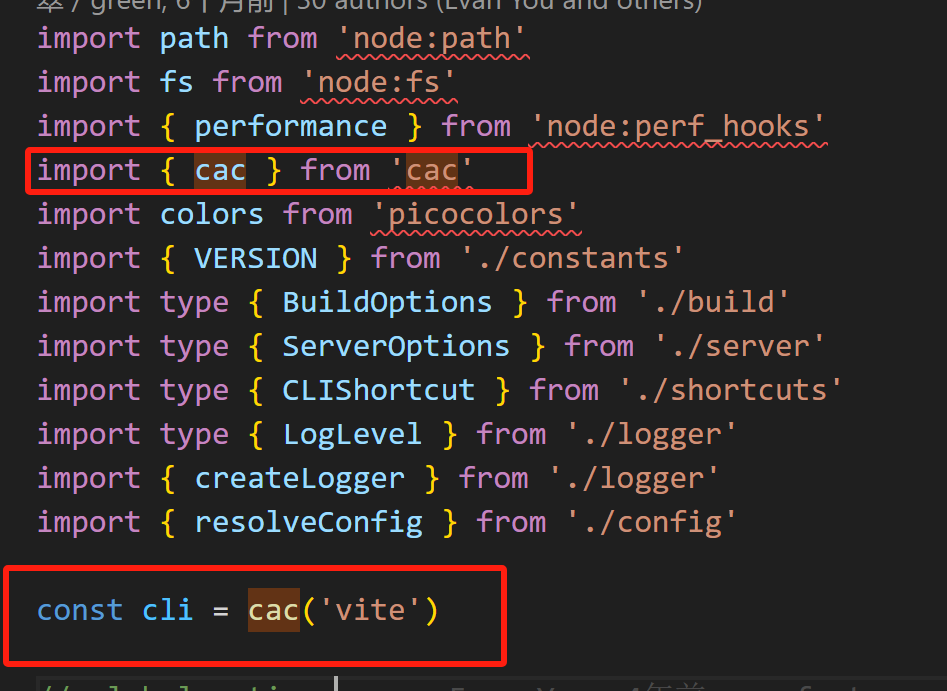
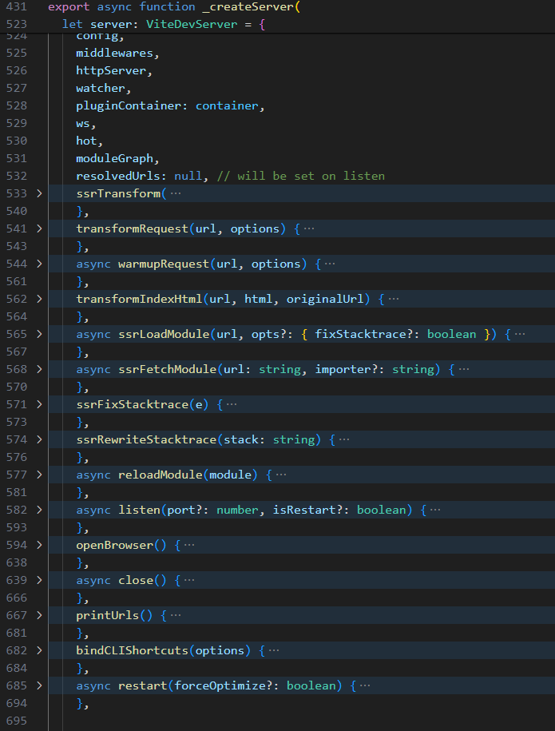
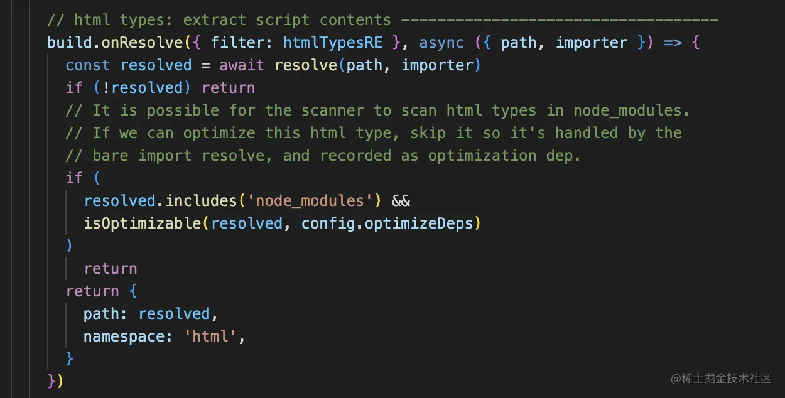
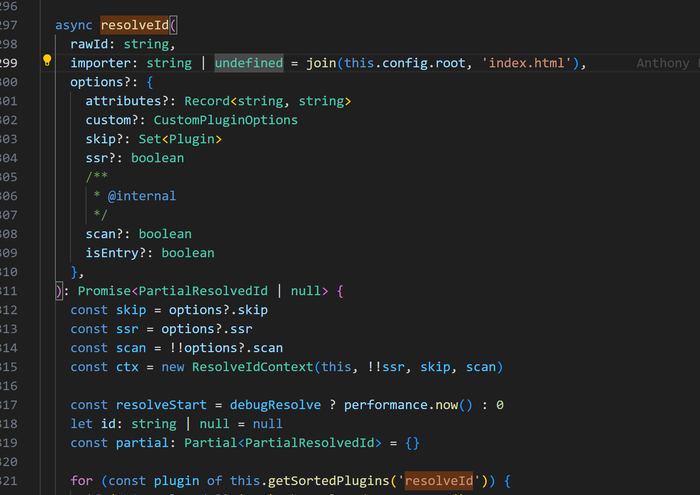
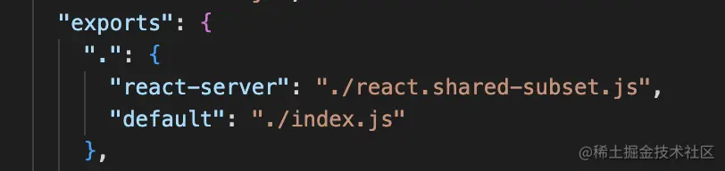
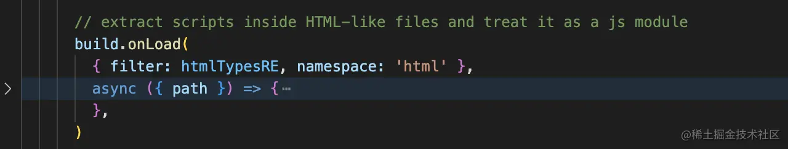
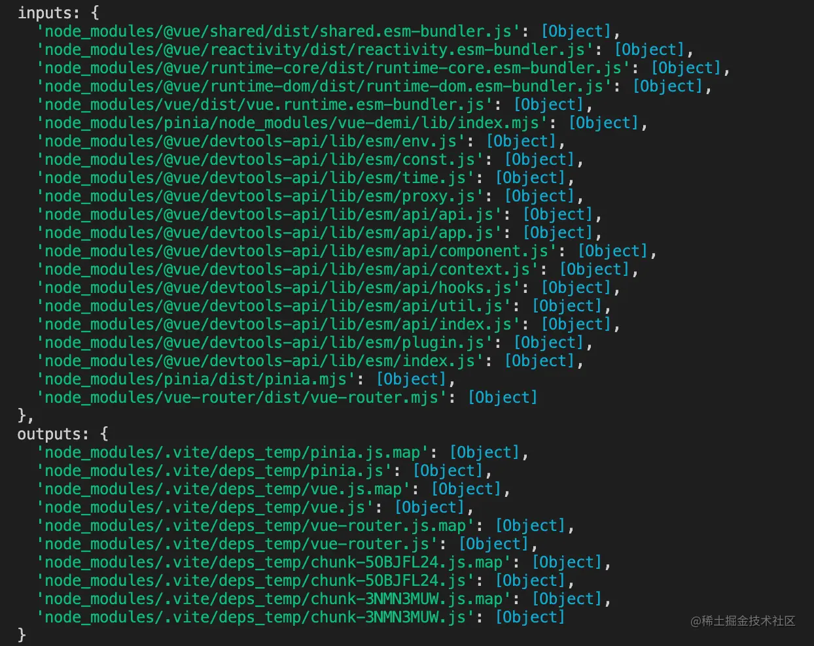

# vite 本地服务器、esbuild、rollup 以及跨域的处理

### vite 是如何来判断环境的

```js
// 只讲dev和build、preview，其他的操作先删除
"scripts": {
  "dev": "vite",
  "build": "vite build",
  "preview": "vite preview",
},
```

- `npm run dev` vite 会创建一个本地服务器
- `npm run build` vite 会编译代码，并输出到 dist 目录
- `npm run preview` vite 会启动一个本地服务器，并打开浏览器访问预览

执行这些脚本，本质就是 npx vite 命令， bin/vite 文件的 start 函数

```js
function start() {
  return import('../dist/node/cli.js')
}
```

其中 cli.js 就是 vite 的入口文件，它会根据命令行参数来判断是 dev、build、preview 还是其他操作，然后执行对应的操作。



通过 cli 对象注册 dev 命令，和 build、preview 命令

```js
// dev
cli
  .command('[root]', 'start dev server') // default command
  .alias('serve') // the command is called 'serve' in Vite's API
  .alias('dev') // alias to align with the script name
  ...

// build
cli
  .command('build [root]', 'build for production')
  ...

// preview
cli
  .command('preview [root]', 'locally preview production build')
```

`action`回调函数会根据命令行参数来执行对应的操作，比如 dev 命令会执行 `startDevServer` 函数，build 命令会执行 `build` 函数，preview 命令会执行 `preview` 函数。

### cli.command('dev')

```js
cli
  .command('[root]', 'start dev server') // default command
  .alias('serve') // the command is called 'serve' in Vite's API
  .alias('dev') // alias to align with the script name
  .option('--host [host]', `[string] specify hostname`, { type: [convertHost] })
  .option('--port <port>', `[number] specify port`)
  .option('--open [path]', `[boolean | string] open browser on startup`)
  .option('--cors', `[boolean] enable CORS`)
  .option('--strictPort', `[boolean] exit if specified port is already in use`)
  .option(
    '--force',
    `[boolean] force the optimizer to ignore the cache and re-bundle`,
  )
  .action(async (root: string, options: ServerOptions & GlobalCLIOptions) => {
    filterDuplicateOptions(options)
    // output structure is preserved even after bundling so require()
    // is ok here
    // 导入createServer函数，创建一个本地服务器
    const { createServer } = await import('./server')
    try {
      // 创建server对象
      const server = await createServer({
        root,
        base: options.base,
        mode: options.mode,
        configFile: options.config,
        logLevel: options.logLevel,
        clearScreen: options.clearScreen,
        optimizeDeps: { force: options.force },
        server: cleanOptions(options),
      })
      // 创建失败，就抛错
      if (!server.httpServer) {
        throw new Error('HTTP server not available')
      }
       // 监听端口，启动服务
      await server.listen()
      // 打印url
      const info = server.config.logger.info
      // 打印启动时间
      const viteStartTime = global.__vite_start_time ?? false
      //
      const startupDurationString = viteStartTime
        ? colors.dim(
            `ready in ${colors.reset(
              colors.bold(Math.ceil(performance.now() - viteStartTime)),
            )} ms`,
          )
        : ''
      const hasExistingLogs =
        process.stdout.bytesWritten > 0 || process.stderr.bytesWritten > 0

      info(
        `\n  ${colors.green(
          `${colors.bold('VITE')} v${VERSION}`,
        )}  ${startupDurationString}\n`,
        {
          clear: !hasExistingLogs,
        },
      )

      server.printUrls()
       //   VITE v5.3.1  ready in 1157 ms
        //   ➜  Local:   http://localhost:5173/
        //   ➜  Network: use --host to expose
        //   ➜  press h to show help
      // 定义自定义快捷键数组
      const customShortcuts: CLIShortcut<typeof server>[] = []
      // 如果存在profileSession，则添加一个快捷键
      if (profileSession) {
        customShortcuts.push({
          key: 'p',
          description: 'start/stop the profiler',
          // 定义快捷键动作
          async action(server) {
            if (profileSession) {
              await stopProfiler(server.config.logger.info)
            } else {
              const inspector = await import('node:inspector').then(
                (r) => r.default,
              )
              await new Promise<void>((res) => {
                profileSession = new inspector.Session()
                profileSession.connect()
                profileSession.post('Profiler.enable', () => {
                  profileSession!.post('Profiler.start', () => {
                    server.config.logger.info('Profiler started')
                    res()
                  })
                })
              })
            }
          },
        })
      }
      // 绑定CLI快捷键
      server.bindCLIShortcuts({ print: true, customShortcuts })
    } catch (e) {
      const logger = createLogger(options.logLevel)
      logger.error(colors.red(`error when starting dev server:\n${e.stack}`), {
        error: e,
      })
      stopProfiler(logger.info)
      process.exit(1)
    }
  })
```

扩展：上面简单的指令如下所示，能够按照指令，对服务进行重启、打印 url、打开浏览器、清空控制台、终止进程等操作

```js
let BASE_SHORTCUTS = [
  {
    key: 'r',
    description: 'restart the server',
    async action(server) {
      await server.restart()
    },
  },
  {
    key: 'u',
    description: 'show server url',
    action(server) {
      server.config.logger.info('')
      server.printUrls()
    },
  },
  {
    key: 'o',
    description: 'open in browser',
    action(server) {
      const url = server.resolvedUrls?.local[0]
      if (!url) {
        server.config.logger.warn('No URL available to open in browser')
        return
      }
      openBrowser(url, true, server.config.logger)
    },
  },
  {
    key: 'c',
    description: 'clear console',
    action(server) {
      server.config.logger.clearScreen('error')
    },
  },
  {
    key: 'q',
    description: 'quit',
    async action(server) {
      await server.close().finally(() => process.exit())
    },
  },
]
```

### cli.command('build')

```js
cli
    .command('build [root]', 'build for production')
    .(...)
    .action(async (root, options) => {

    // 处理options
    filterDuplicateOptions(options);

    // 引入build函数，进行打包
    const { build } = await import('./build')

    // 调用cleanOptions函数，删除掉打包配置一些属性
    const buildOptions = cleanOptions(options);

    // 调用build函数，打包
    try {
        await build({
            root,
            base: options.base,
            mode: options.mode,
            configFile: options.config,
            logLevel: options.logLevel,
            clearScreen: options.clearScreen,
            optimizeDeps: { force: options.force },
            build: buildOptions,
        });
    }
    catch (e) {
        createLogger(options.logLevel).error(picocolorsExports.red(`
        error during build:\n${e.stack}`), { error: e });
        process.exit(1);
    }
    finally {
        // 最后在控制台输出打包的结果
        stopProfiler((message) => createLogger(options.logLevel).info(message));
    }
});

```

### cli.command('preview')

```js
cli
    .command('preview [root]', 'locally preview production build')
    .(...)
    .action(async (root, options) => {

    // 处理options
    filterDuplicateOptions(options);

    // 导入preview函数
    const { preview } = await import('./preview')

    // 执行preview函数
    try {
        const server = await preview({
            root,
            base: options.base,
            configFile: options.config,
            logLevel: options.logLevel,
            mode: options.mode,
            build: {
                outDir: options.outDir,
            },
            preview: {
                port: options.port,
                strictPort: options.strictPort,
                host: options.host,
                open: options.open,
            },
        });
        // 打印，与dev类似
        server.printUrls();
    }
    catch (e) {
        createLogger(options.logLevel).error(
        picocolorsExports.red(`error when starting preview server:\n${e.stack}`), { error: e });
        process.exit(1);
    }
    finally {
        // 最后在控制台输出打包的结果
        stopProfiler((message) => createLogger(options.logLevel).info(message));
    }
});

```

- dev 命令，通过 createServer 函数创建了一个服务器，再注册了一些指令来辅助开发。
- build 命令，通过 build 函数，进行打包。
- preview 命令，通过 preview 函数，开启一个本地服务器，模拟 production 环境
  

并且 vite 服务器是借助于中间件 connect 服务器实现的：

```js
 const middlewares = connect() as Connect.Server
  const httpServer = middlewareMode
    ? null
    : await resolveHttpServer(serverConfig, middlewares, httpsOptions)
```

#### resolveHttpServer

通过 connect 中间件，传入 resolveHttpServer，创建一个 web 服务器

```js
export async function resolveHttpServer(
  { proxy }: CommonServerOptions,
  app: Connect.Server,
  httpsOptions?: HttpsServerOptions
): Promise<HttpServer> {
  // 如果没有提供httpsOptions，则创建一个HTTP服务器
  if (!httpsOptions) {
    const { createServer } = await import('node:http')
    return createServer(app)
  }

  // 如果需要代理，则创建一个HTTPS服务器
  // #484 fallback to http1 when proxy is needed.
  if (proxy) {
    const { createServer } = await import('node:https')
    return createServer(httpsOptions, app)
  } else {
    // 否则，创建一个支持HTTP/2的安全服务器
    const { createSecureServer } = await import('node:http2')
    return createSecureServer(
      {
        // 手动增加会话内存以防止大量请求时的502 ENHANCE_YOUR_CALM错误
        maxSessionMemory: 1000,
        ...httpsOptions,
        allowHTTP1: true,
      },
      app
    )
  }
}
```

我们可以看到，viteDevServer 上挂载了很多静态方法与属性，其中 listen 方法也被挂在了上面，之后通过调用 server.listen()方法启动服务器，说白了就是 connect.listen()。

```js
async listen(port?: number, isRestart?: boolean) {
  await startServer(server, port) // 启动服务器
  if (httpServer) {
    // 搞到启动的url
    server.resolvedUrls = await resolveServerUrls(
      httpServer,
      config.server,
      config,
    )
    // 根据简短指令与config的配置，是否自动打开浏览器
    if (!isRestart && config.server.open) server.openBrowser()
  }
  return server
},

```

在 createServer 函数中，还创建了一个 ws 服务来做 HMR。

```js
...
const ws = createWebSocketServer(httpServer, config, httpsOptions)

```

`connect`本地服务器，你可以认为它是一种`express`服务，因为 express 就是在 connect 的上层做了封装而已。

### vite 与 esbuild

在开发环境中，vite 是怎么去要求 esbuild 能够做 vite 具体想做的事情呢？因为在 vite 中很多地方都用到了 esbuild，比如预编译、转换 TypeScript、转换 Jsx、Tsx 等，那么这里我们再来深入了解一下预编译，为什么要做依赖预解析。预构建的入口是 initDepsOptimizer 函数，

#### initDepsOptimizer

在`initDepsOptimizer`函数里面，调用`createDepsOptimizer`创建了一个依赖分析器，并且通过`loadCachedDepOptimizationMetadata`获取了上一次预构建的产物`cachedMetadata`。

```js
async function createDepsOptimizer(
  config: ResolvedConfig,
  server: ViteDevServer,
): Promise<void> {
  const { logger } = config
  const ssr = false
  const sessionTimestamp = Date.now().toString()
// 获取与构建的依赖，元信息
  const cachedMetadata = await loadCachedDepOptimizationMetadata(config, ssr)
  ....
}
```

#### loadCachedDepOptimizationMetadata

```js
// 加载缓存的依赖优化元数据，如果需要强制重新优化，则删除旧的缓存目录
export async function loadCachedDepOptimizationMetadata(
  config: ResolvedConfig,
  ssr: boolean,
  force = config.optimizeDeps.force,
  asCommand = false
): Promise<DepOptimizationMetadata | undefined> {
  const log = asCommand ? config.logger.info : debug

  if (firstLoadCachedDepOptimizationMetadata) {
    firstLoadCachedDepOptimizationMetadata = false
    // 启动一个清理过时处理依赖目录的定时任务，如果之前的进程退出过早
    setTimeout(() => cleanupDepsCacheStaleDirs(config), 0)
  }

  const depsCacheDir = getDepsCacheDir(config, ssr)

  if (!force) {
    let cachedMetadata: DepOptimizationMetadata | undefined
    try {
      // 定义缓存的元数据路径，路径由依赖缓存目录和元数据文件名组成
      const cachedMetadataPath = path.join(depsCacheDir, METADATA_FILENAME)
      // 从缓存的元数据路径读取文件内容，并解析为依赖优化器元数据对象
      cachedMetadata = parseDepsOptimizerMetadata(
        await fsp.readFile(cachedMetadataPath, 'utf-8'),
        depsCacheDir
      )
    } catch (e) {}
    // 如果哈希值一致，则无需重新打包
    if (cachedMetadata) {
      if (cachedMetadata.lockfileHash !== getLockfileHash(config, ssr)) {
        config.logger.info(
          'Re-optimizing dependencies because lockfile has changed'
        )
      } else if (cachedMetadata.configHash !== getConfigHash(config, ssr)) {
        config.logger.info(
          'Re-optimizing dependencies because vite config has changed'
        )
      } else {
        log?.('Hash is consistent. Skipping. Use --force to override.')
        // 由于我们使用的是缓存，因此无需提交或取消，只需解决处理承诺，以便请求可以继续
        return cachedMetadata
      }
    }
  } else {
    config.logger.info('Forced re-optimization of dependencies')
  }

  // 从新的缓存开始
  debug?.(colors.green(`removing old cache dir ${depsCacheDir}`))
  await fsp.rm(depsCacheDir, { recursive: true, force: true })
}
```

#### \_metadata.json

```json
{
  "hash": "96f200b2",
  "configHash": "6db6cb0e",
  "lockfileHash": "e84813cd",
  "browserHash": "879f271d",
  "optimized": {
    "ramda": {
      "src": "../../../../../node_modules/.pnpm/ramda@0.30.1/node_modules/ramda/es/index.js",
      "file": "ramda.js",
      "fileHash": "aeacaeb3",
      "needsInterop": false
    }
  },
  "chunks": {}
}
```

在此文件中，记录了预解析之后的源文件路径，并且会以强缓存的形式缓存这些依赖。 预构建流程在源码中分为两部分：

- 第一种是：通过命令行 vite optimize 来手动预解析，调用 optimizeDeps 函数
  #### optimizeDeps

```js
export async function optimizeDeps(
  config: ResolvedConfig, // 接收一个 ResolvedConfig 类型的配置对象作为参数
  force = config.optimizeDeps.force, // 默认情况下，force 参数的值等于 config.optimizeDeps.force 的值
  asCommand = false // 默认情况下，asCommand 参数为 false
): Promise<DepOptimizationMetadata> {
  // 返回一个 Promise 对象，其泛型类型为 DepOptimizationMetadata
  // 此函数用于优化项目的依赖项，支持强制优化和作为命令行工具调用
  const log = asCommand ? config.logger.info : debug
  const ssr = false

  const cachedMetadata = await loadCachedDepOptimizationMetadata(
    config,
    ssr,
    force,
    asCommand
  )
  if (cachedMetadata) {
    return cachedMetadata
  }

  // 此代码用于发现项目的依赖项，并将其结果存储在 deps 变量中
  const deps = await discoverProjectDependencies(config).result

  // 添加手动包含的优化依赖项
  await addManuallyIncludedOptimizeDeps(deps, config, ssr)

  // 生成依赖项日志字符串
  const depsString = depsLogString(Object.keys(deps))
  // 记录优化依赖项信息
  log?.(colors.green(`Optimizing dependencies:\n  ${depsString}`))

  // 转换为已发现的依赖项信息 DiscoveredDependencyInfo 类型的对象
  const depsInfo = toDiscoveredDependencies(config, deps, ssr)

  // 运行优化依赖项并获取结果
  const result = await runOptimizeDeps(config, depsInfo, ssr).result

  // 提交优化结果
  await result.commit()

  // 返回优化结果的元数据 返回优化结果的 metadata 属性，即 DepOptimizationMetadata 对象
  return result.metadata
}
```

1. Vite 在 optimizeDeps 函数中调用 loadCachedDepOptimizationMetadata 函数，读取上一次预构建的产物，如果产物存在，则直接 return。
2. 如果不存在则调用 discoverProjectDependencies 对依赖进行扫描，获取到项目中的所有依赖，并返回一个 deps。
3. 然后通过 toDiscoveredDependencies 函数把依赖包装起来，再通过 runOptimizeDeps 进行依赖打包。
4. 返回 metadata 产物。

- 第二种是：在 createServer 函数中，调用 initDepsOptimizer -> createDepsOptimizer -> loadCachedDepOptimizationMetadata -> discoverProjectDependencies -> toDiscoveredDependencies -> runOptimizeDeps

#### discoverProjectDependencies

```js
export function discoverProjectDependencies(config: ResolvedConfig): {
  cancel: () => Promise<void>
  result: Promise<Record<string, string>>
} {
  // 扫描导入的依赖项，并返回取消操作和结果的Promise
  const { cancel, result } = scanImports(config)

  return {
    cancel,
    result: result.then(({ deps, missing }) => {
      // 检查是否有缺失的依赖项，如果有则抛出错误
      const missingIds = Object.keys(missing)
      if (missingIds.length) {
        throw new Error(
          `The following dependencies are imported but could not be resolved:\n\n  ${missingIds
            .map(
              (id) =>
                `${colors.cyan(id)} ${colors.white(
                  colors.dim(`(imported by ${missing[id]})`),
                )}`,
            )
            .join(`\n  `)}\n\nAre they installed?`,
        )
      }

      // 返回找到的依赖项
      return deps
    }),
  }
}
```

#### scanImports

`scanImports`会通过`computeEntries`方法获取入口文件，其中核心方法就是 `entries = await globEntries('\*_/_.html', config)`。

```js
export function scanImports(config: ResolvedConfig): {
  cancel: () => Promise<void>
  result: Promise<{
    deps: Record<string, string>
    missing: Record<string, string>
  }>
} {
  // Only used to scan non-ssr code

  const start = performance.now()
  const deps: Record<string, string> = {}
  const missing: Record<string, string> = {}
  let entries: string[]

  const scanContext = { cancelled: false }

  // 获取入口文件
  const esbuildContext: Promise<BuildContext | undefined> = computeEntries(
    config,
  ).then((computedEntries) => {
    entries = computedEntries // 赋值

    if (!entries.length) {
      ...
    }
    // 取消就return
    if (scanContext.cancelled) return

    debug(`Crawling dependencies using entries:\n  ${entries.join('\n  ')}`)
    return prepareEsbuildScanner(config, entries, deps, missing, scanContext)
  })
}
// 省略一部分代码...
```

- computeEntries 函数里面调用 globEntries 获取\*\*\*.html 入口文件。
- globEntries 使用了 fast-glob 库来读取目录

```js
import fg from 'fast-glob'
/**
 * Return all folders from the project directory
 * @param options
 */

async function getDirectories(config) {
  const { dir = 'src', root = process.cwd(), deep = true, depth = 1 } = config

  const directories = await fg.sync(deep ? `${dir}/**/*` : `${dir}/*`, {
    ignore: ['node_modules'], // 忽略
    onlyDirectories: false, // 只读出文件夹
    cwd: root, // 需要检测的路径
    deep: depth, // 嵌套层级
    absolute: true, // 相对、绝对路径
  })

  if (!directories.length) {
    // 给出警告，我简化成console.log
    console.log('No Directories could be found!')
  }
  return directories
}

const config = {
  dir: 'src',
  root: process.cwd(),
  deep: true,
  depth: 2,
}
getDirectories(config).then((list) => {
  console.log(list)
})
```

#### prepareEsbuildScanner

```js
async function prepareEsbuildScanner(
  config: ResolvedConfig, // Vite 的配置项
  entries: string[], // 用于构建的入口文件路径列表
  deps: Record<string, string>, // 依赖关系的映射表
  missing: Record<string, string>, // 缺失的依赖关系的映射表
  scanContext?: { cancelled: boolean } // 扫描上下文
): Promise<BuildContext | undefined> {
  // 返回一个 esbuild 构建环境
  // 创建插件容器
  const container = await createPluginContainer(config)

  // 如果扫描上下文被取消了，直接返回
  if (scanContext?.cancelled) return

  // 生成一个 esbuild 扫描插件
  const plugin = esbuildScanPlugin(config, container, deps, missing, entries)

  // 获取 esbuild 的插件和构建选项
  const { plugins = [], ...esbuildOptions } =
    config.optimizeDeps?.esbuildOptions ?? {}

  // 调用 esbuild 的 context 函数，返回依赖图上下文对象
  return await esbuild.context({
    absWorkingDir: process.cwd(),
    write: false, // 不输出文件，因为第一次调用esbuild的时候只是做一个扫描
    stdin: {
      // 拿到入口，拼成js字符串
      contents: entries.map((e) => `import ${JSON.stringify(e)}`).join('\n'),
      loader: 'js',
    },
    bundle: true,
    format: 'esm',
    logLevel: 'silent',
    plugins: [...plugins, plugin],
    ...esbuildOptions,
  })
}
```

`扩展`：为什么要使用插件：

- 因为 esbuild 不认识 html，所以需要插件来处理。
- esbuild 插件大致如下图用法：

```js
import * as esbuild from 'esbuild'

let envPlugin = {
  name: 'env',
  setup(build) {
    // Intercept import paths called "env" so esbuild doesn't attempt
    // to map them to a file system location. Tag them with the "env-ns"
    // namespace to reserve them for this plugin.
    // 路径重写
    build.onResolve({ filter: /^env$/ }, (args) => ({
      path: args.path,
      namespace: 'env-ns',
    }))

    // Load paths tagged with the "env-ns" namespace and behave as if
    // they point to a JSON file containing the environment variables.
    // 内容处理
    build.onLoad({ filter: /.*/, namespace: 'env-ns' }, () => ({
      contents: JSON.stringify(process.env),
      loader: 'json',
    }))
  },
}

// 使用
await esbuild.build({
  entryPoints: ['app.js'],
  bundle: true,
  outfile: 'out.js',
  plugins: [envPlugin],
})
```

`esbuild`在读取文件的时候就会调用一次扫描插件`esbuildScanPlugin`，插件里面根据 `build.onResolve`、`build.onLoad` 来选择性处理文件，比如处理 `html` 文件他就会走到这里：

这里的 `resolve` 就是处理路径的核心方法，我们一起来看一下。

```js
const seen = new Map<string, string | undefined>() // 路径映射表
const resolve = async (
  id: string, // 相对或者绝对路径，或者三方模块路径
  // 相对路径 ： ./
  // 决对路径 ： /
  // 三方包路径（裸模块）：'vue'
  importer?: string, // 引用者
  options?: ResolveIdOptions
) => {
  const key = id + (importer && path.dirname(importer))
  if (seen.has(key)) { // 去重
    return seen.get(key)
  }
  // 调用container.resolveId处理路径补全。
    // container 为插件容器，在createServer函数里面创建
    // 此时会遍历执行vite插件，并挂到container上，以供后续调用
  const resolved = await container.resolveId(
    id,
    importer && normalizePath(importer),
    {
      ...options,
      scan: true,
    }
  )
  const res = resolved?.id
  seen.set(key, res)
  return res // 返回处理好的路径
}
```

#### resolveId

如图

在这个插件里面可以看到对 relative、absolute、bare 的处理，比如文件所在项目的根目录为 root:'/Users/mac/Desktop/my-project'

- absolute

比如 import Function from '/Module1'，则路径会被处理成

> import Function from '/Module1' => import Function from '/Users/mac/Desktop/my-project/Module'

- relative 对于 relative 有两种，请看代码：

```js
// 如果模块被人引用，则基础路径为引用者，否则就是npm run xx 的当前目录
const basedir = importer ? path.dirname(importer) : process.cwd()
```

比如引用者的路径为`importerPath:'/Users/mac/Desktop/my-project/importerPath'`，则路径会被处理成：

> import Function from '/Module2' => /Users/mac/Desktop/my-project/importerPath/Module2'

- bare module

  - bare module 也就是第三方模块，我们以 react 为例，关于这个的路径处理是这样的。

  - 先去 node_modules 里面去找到 react 路径，记录为：path=node_module/react/。

  - 找到 react 路径下的 package.json 文件中的 exports 字段的 default 属性，如果没有则会去找 module 字段。

  - 拼接 path 与 exports 或者 module 组成完整路径。
    

比如 import React from 'react'，则路径会被处理成：

> import React from 'react' => import React from '/Users/mac/Desktop/my-project/node_module/react/index.js'

路径处理完毕之后，就会 return 出去，就会被 onLoad 接收，就像这面这样：

在 onLoad 函数中，就会读取 html 内容：

```js
let raw = fs.readFileSync(path, 'utf-8')
```

读取 html 内容之后，就会匹配出 script 的 src 属性，找到 js 模块，就会触发 build.OnResolve 解析 js 模块，从而找到模块中的裸模块，也就是第三方依赖。

`扩展`：这里分享几个实用的正则，感兴趣的可以看一下：

```js
const scriptModuleRE =
  /(<script\b[^>]+type\s*=\s*(?:"module"|'module')[^>]*>)(.*?)<\/script>/gis
export const scriptRE = /(<script(?:\s[^>]*>|>))(.*?)<\/script>/gis
export const commentRE = /<!--.*?-->/gs
const srcRE = /\bsrc\s*=\s*(?:"([^"]+)"|'([^']+)'|([^\s'">]+))/i
const typeRE = /\btype\s*=\s*(?:"([^"]+)"|'([^']+)'|([^\s'">]+))/i
const langRE = /\blang\s*=\s*(?:"([^"]+)"|'([^']+)'|([^\s'">]+))/i
const contextRE = /\bcontext\s*=\s*(?:"([^"]+)"|'([^']+)'|([^\s'">]+))/i
```

找到了第三方模块之后调用 runOptimizeDeps 进行打包，我们来看一下源码：

#### runOptimizeDeps

```js
export function runOptimizeDeps(
  resolvedConfig: ResolvedConfig,
  depsInfo: Record<string, OptimizedDepInfo>,
  ssr: boolean = resolvedConfig.command === 'build' &&
    !!resolvedConfig.build.ssr,
): {
  ...
  // 获取.vite/deps路径
  const depsCacheDir = getDepsCacheDir(resolvedConfig, ssr)
  const processingCacheDir = getProcessingDepsCacheDir(resolvedConfig, ssr)

  // 先处理一下.vite/deps目录
  if (fs.existsSync(processingCacheDir)) {
    // 存在就置空
    emptyDir(processingCacheDir)
  } else {
    // 不存在就创建
    fs.mkdirSync(processingCacheDir, { recursive: true })
  }

  // 写入package.json 指定ESM规范
  writeFile(
    path.resolve(processingCacheDir, 'package.json'),
    JSON.stringify({ type: 'module' }),
  )

  // 获得元数据
  const metadata = initDepsOptimizerMetadata(config, ssr)

  // 写入browserHash
  metadata.browserHash = getOptimizedBrowserHash(
    metadata.hash,
    depsFromOptimizedDepInfo(depsInfo),
  )
  // 省略一部分代码

  const start = performance.now() // 记录时间

  // 调用prepareEsbuildOptimizerRun里面的esbuild.context打包
  const preparedRun = prepareEsbuildOptimizerRun(
    resolvedConfig,
    depsInfo,
    ssr,
    processingCacheDir,
    optimizerContext,
  )
  // 省略了一些代码 ...

```

#### prepareEsbuildOptimizerRun

prepareEsbuildOptimizerRun 函数做了几件事

- 先把 deps 拍平成一维数组。
- 调用 build.context 进行打包。
- 输出打包的映射对象 result，对象长这样：
  
- 遍历 outputs，把打包结果输出到 processingCacheDir，也就是.vite/deps。

```js
const dataPath = path.join(processingCacheDir, '_metadata.json')
writeFile(
  dataPath, // 写入元数据
  stringifyDepsOptimizerMetadata(metadata, depsCacheDir)
)
```

- 通过 esbuild 插件扫描和 esbuild.context 打包，最后得到的优化依赖的结果会被缓存起来，并且写到了 node_module/.vite/deps 目录下。

此过程就是预解析的过程，esbuild 是一个打包器，在开发阶段全权依赖于它。

### esbuild 处理 TypeScript、Jsx、Tsx

`esbuild` 内置了对 `TypeScript` 和 `JSX/TSX` 的原生支持，无需安装额外的插件或配置。当 `esbuild` 发现一个文件的扩展名是`.ts，.tsx，.jsx 或者.mjs` 时，会自动启用 `TypeScript` 和 `JSX/TSX` 支持，并将其转换为 `JavaScript。`

在转换过程中，`esbuild 会首先进行预处理（preprocessing）和解析（parsing），然后进行类型检查（type-checking）`，最后将其转换为 JavaScript 代码。

需要注意的是，`esbuild` 的 `TypeScript` 和`JSX/TSX`支持还没有完全与标准的 `TypeScript` 和 `JSX/TSX `语法保持一致，尤其是在一些高级特性和边缘情况下可能会有一些不一致的行为。因此在使用 `esbuild` 进行 `TypeScript` 和 `JSX/TSX` 编译时，比如：

    - `babel-plugin-macros`，它是一个`Babel`插件，允许你使用`JavaScript`代码来生成代码，这种技术被称为“宏”。使用宏可以提供更好的开发体验，减少样板代码并提高代码可读性。

在使用 `esbuild` 时，`babel-plugin-macros` 是不支持的，因为它是一个 `Babel` 插件，而 `esbuild` 不会执行 `Babel` 插件。在这种情况下，你需要找到其他解决方案，或者使用其他工具来替代 `esbuild`.

另一个例子是 `WebAssembly，esbuild` 在处理 `WebAssembly` 时，需要依赖一个第三方插件` esbuild-wasm`。如果你在使用 `esbuild` 时需要处理 `WebAssembly`，那么你需要确保已经安装了这个插件，并且已经配置好了 `esbuild` 的相关设置。

### rollup 打包

#### build

```js
export async function build(
  inlineConfig: InlineConfig = {},
): Promise<RollupOutput | RollupOutput[] | RollupWatcher> {
  // 从inlineConfig和vite.config.json里面解析依赖，并合并
  const config = await resolveConfig(
    inlineConfig,
    'build',
    'production',
    'production',
  )
  // 获取构建配置
  const options = config.build

  // 判断是否需要生成 SSR 相关的代码
  const ssr = !!options.ssr

  // 如果是构建库，则获取库构建相关的配置
  const libOptions = options.lib

  // 在控制台打印，正在构建...
  config.logger.info(
    colors.cyan(
      `vite v${VERSION} ${colors.green(
        `building ${ssr ? `SSR bundle ` : ``}for ${config.mode}...`,
      )}`,
    ),
  )

  // 定义 resolve 函数用于解析路径
  const resolve = (p: string) => path.resolve(config.root, p)

  // 获取入口文件
  const input = libOptions
    ? options.rollupOptions?.input ||
      (typeof libOptions.entry === 'string'
        ? resolve(libOptions.entry)
        : Array.isArray(libOptions.entry)
        ? libOptions.entry.map(resolve)
        : Object.fromEntries(
            Object.entries(libOptions.entry).map(([alias, file]) => [
              alias,
              resolve(file),
            ]),
          ))
    : typeof options.ssr === 'string'
    ? resolve(options.ssr)
    : options.rollupOptions?.input || resolve('index.html')

  // 如果是SSR并且入口文件是html就抛错
  if (ssr && typeof input === 'string' && input.endsWith('.html')) {
    throw new Error(
      `rollupOptions.input should not be an html file when building for SSR. ` +
        `Please specify a dedicated SSR entry.`,
    )
  }

  // 获取输出目录
  const outDir = resolve(options.outDir)

  // 如果是 SSR 构建，则在插件中注入 ssr 参数
  const plugins = (
    ssr ? config.plugins.map((p) => injectSsrFlagToHooks(p)) : config.plugins
  ) as Plugin[]

  // 获取用户配置的 external
  const userExternal = options.rollupOptions?.external
  let external = userExternal

  // 如果构建 SSR，且配置了 legacy.buildSsrCjsExternalHeuristics，则需要对 external 进行处理
  if (ssr && config.legacy?.buildSsrCjsExternalHeuristics) {
    external = await cjsSsrResolveExternal(config, userExternal)
  }

  // 如果启用了依赖优化，则初始化依赖优化
  if (isDepsOptimizerEnabled(config, ssr)) {
    await initDepsOptimizer(config)
  }

  // 配置 RollupOptions
  const rollupOptions: RollupOptions = {
    context: 'globalThis',
    preserveEntrySignatures: ssr
      ? 'allow-extension'
      : libOptions
      ? 'strict'
      : false,
    cache: config.build.watch ? undefined : false,
    ...options.rollupOptions,
    input,
    plugins,
    external,
    onwarn(warning, warn) {
      onRollupWarning(warning, warn, config)
    },
  }

  ...

  // 定义bundle.js
  let bundle: RollupBuild | undefined
  try {
    const buildOutputOptions = (output: OutputOptions = {}): OutputOptions => {
      // 省略了一些判断...
      const ssrNodeBuild = ssr && config.ssr.target === 'node'
      const ssrWorkerBuild = ssr && config.ssr.target === 'webworker'
      const cjsSsrBuild = ssr && config.ssr.format === 'cjs'

      const format = output.format || (cjsSsrBuild ? 'cjs' : 'es')
      const jsExt =
        ssrNodeBuild || libOptions
          ? resolveOutputJsExtension(format, getPkgJson(config.root)?.type)
          : 'js'
      return {  // 生成buildOutputOptions对象
        dir: outDir,
        // Default format is 'es' for regular and for SSR builds
        format,
        exports: cjsSsrBuild ? 'named' : 'auto',
        sourcemap: options.sourcemap, // 启用sourceMap
        name: libOptions ? libOptions.name : undefined, // name命名规则
        generatedCode: 'es2015', // 目标代码版本呢

        // 文件名、chunks名，生成规则
        entryFileNames: ssr
          ? `[name].${jsExt}`
          : libOptions
          ? ({ name }) =>
              resolveLibFilename(libOptions, format, name, config.root, jsExt)
          : path.posix.join(options.assetsDir, `[name]-[hash].${jsExt}`),
        chunkFileNames: libOptions
          ? `[name]-[hash].${jsExt}`
          : path.posix.join(options.assetsDir, `[name]-[hash].${jsExt}`),
        assetFileNames: libOptions
          ? `[name].[ext]`
          : path.posix.join(options.assetsDir, `[name]-[hash].[ext]`),
        inlineDynamicImports:
          output.format === 'umd' ||
          output.format === 'iife' ||
          (ssrWorkerBuild &&
            (typeof input === 'string' || Object.keys(input).length === 1)),
        ...output,
      }
    }

    // 多入口打包处理、或者单入口打包处理
    const outputs = resolveBuildOutputs(
      options.rollupOptions?.output,
      libOptions,
      config.logger,
    )
    const normalizedOutputs: OutputOptions[] = []

    if (Array.isArray(outputs)) {
      // 如果打包结果有多个
      for (const resolvedOutput of outputs) {
        // 就获取单个的打包结果
        normalizedOutputs.push(buildOutputOptions(resolvedOutput))
      }
    } else {
      // 否则直接拿到输出对象
      normalizedOutputs.push(buildOutputOptions(outputs))
    }

    // 获取到输出路径，取到dir，一般是dist
    const outDirs = normalizedOutputs.map(({ dir }) => resolve(dir!))

    // 用rollup监听文件变化
    if (config.build.watch) {
      config.logger.info(colors.cyan(`\nwatching for file changes...`))

      const resolvedChokidarOptions = resolveChokidarOptions(
        config,
        config.build.watch.chokidar,
      )

      const { watch } = await import('rollup')
      const watcher = watch({
        ...rollupOptions,
        output: normalizedOutputs,
        watch: {
          ...config.build.watch,
          chokidar: resolvedChokidarOptions,
        },
      })

      // 监听打包开始、结束、异常
      watcher.on('event', (event) => {
        if (event.code === 'BUNDLE_START') {
          config.logger.info(colors.cyan(`\nbuild started...`))
          if (options.write) {
            // 校验输出目录规则
            prepareOutDir(outDirs, options.emptyOutDir, config)
          }
        } else if (event.code === 'BUNDLE_END') {
          event.result.close()
          // 计算打包耗时
          config.logger.info(colors.cyan(`built in ${event.duration}ms.`))
        } else if (event.code === 'ERROR') {
          // 异常，调用outputBuildError，输出异常信息
          outputBuildError(event.error)
        }
      })

      return watcher
    }

    // 通过rollup打包生成文件
    const { rollup } = await import('rollup')
    bundle = await rollup(rollupOptions)

    if (options.write) {
      // 校验输出目录规则
      prepareOutDir(outDirs, options.emptyOutDir, config)
    }

    const res = []
    for (const output of normalizedOutputs) {
      // 通过bundle = await rollup(rollupOptions)，返回一个Promise对象
      // 根据write或者generate指令，相应的对输出文件dist目录写入，和对象代码的生成
      res.push(await bundle[options.write ? 'write' : 'generate'](output))
    }
    return Array.isArray(outputs) ? res : res[0]
  } catch (e) {
    // 异常报错
    outputBuildError(e)
    throw e
  } finally {
    // 打包结束。终止进程
    if (bundle) await bundle.close()
  }
}

```

`build`函数，就通过找查入口文件，交给`rollup`进行打包，并且监听每个文件的变化和打包开始，结束，异常三种情况，然后通过`prepareOutDir`函数，进行输出目录的校验，之后遍历执行每个`bundle`，交给`rollup`执行，通过控制指令(`write` 或者 `generate`)来控制文件写入或者代码生成，把包含 `Promise` 的结果放进 `res` 数组里面并返回

#### prepareOutDIR

```JS
function prepareOutDir(
  outDirs: string[], // 接收一个字符串数组参数，表示输出目录
  emptyOutDir: boolean | null, // 表示是否清空输出目录，为布尔值或 null
  config: ResolvedConfig, // 表示已解析的配置
) {
  const nonDuplicateDirs = new Set(outDirs) // 创建一个 Set 对象，用于存储不重复的输出目录
  let outside = false // 是否有输出目录位于项目根目录外
  if (emptyOutDir == null) { // 如果未指定是否清空输出目录
    for (const outDir of nonDuplicateDirs) { // 遍历不重复的输出目录
      if (
        fs.existsSync(outDir) && // 判断输出目录是否存在
        !normalizePath(outDir).startsWith(config.root + '/') // 判断输出目录是否在项目根目录下
      ) {
        // 如果输出目录不在项目根目录下，发出警告，并将 outside 设为 true
        config.logger.warn(
          colors.yellow(
            `\n${colors.bold(`(!)`)} outDir ${colors.white(
              colors.dim(outDir),
            )} is not inside project root and will not be emptied.\n` +
              `Use --emptyOutDir to override.\n`,
          ),
        )
        outside = true
        break // 跳出循环
      }
    }
  }
  for (const outDir of nonDuplicateDirs) { // 再次遍历不重复的输出目录
    if (!outside && emptyOutDir !== false && fs.existsSync(outDir)) {
      // 如果没有输出目录位于项目根目录外，且不禁止清空输出目录，且输出目录存在
      const skipDirs = outDirs
        .map((dir) => {
          const relative = path.relative(outDir, dir) // 获取当前目录到其他目录的相对路径
          if (
            relative && // 相对路径非空
            !relative.startsWith('..') && // 相对路径不以 '..' 开头
            !path.isAbsolute(relative) // 相对路径不是绝对路径
          ) {
            return relative // 返回相对路径
          }
          return '' // 返回空字符串
        })
        .filter(Boolean) // 过滤掉空字符串
      emptyDir(outDir, [...skipDirs, '.git']) // 清空输出目录（除了指定的目录）
    }
    if (
      config.build.copyPublicDir && // 如果配置中指定了 copyPublicDir
      config.publicDir && // public 目录存在
      fs.existsSync(config.publicDir) // public 目录存在于磁盘中
    ) {
      copyDir(config.publicDir, outDir) // 复制 public 目录到输出目录
    }
  }
}

```

### vite preview

vite preview 真的没什么好讲的，就是通过 node 的 http 模块，在本地启动一个 http 服务器，然后对 dist 目录文件路径处理，能够在新开的端口访问到项目，模拟 production 环境而已。
